# CityPrior — location memory from infrastructure cameras as a prior for autonomous driving

> *The vehicle understands its surroundings. The city understands the place.*

A robotaxi sees what is around it **now**. A fixed infrastructure camera watches the **same place** for hours,
days and months. This repository tests, on real data, whether that long-term *location memory* contains
information a vehicle arriving for the first time does not have, and what it would cost to send it.

Eight questions, in order:

1. **Does memory of a place predict what happens there later?** — on real infrastructure-camera data ([Part 1](#part-1--real-data-does-memory-predict)).
2. **Does it help a robotaxi drive?** — closed-loop simulation calibrated on that data ([Part 2](#part-2--closed-loop-simulation-does-memory-help-a-robotaxi-drive)).
3. **Why fixed cameras and not the fleet's own memory** (Mobileye REM, CHAMP)? — both, on the same real traffic ([Part 3](#part-3--fleet-memory-vs-infrastructure-memory)).
4. **Do memory and live signal data add up?** — a full day at an instrumented intersection ([Part 4](#part-4--a-full-day-at-an-instrumented-intersection-dlr-ut)).
5. **Does memory transfer across days?** — four weekday mornings over downtown Athens ([Part 5](#part-5--does-memory-transfer-across-days-pneuma)).
6. **Where does it pay off?** — a cost-benefit model per block face with published unit values ([Part 6](#part-6--where-does-infrastructure-pay-off-cost-benefit)).
7. **Do pedestrians step onto the road at the same places on other days?** — four German intersections filmed in several sessions ([Part 7](#part-7--pedestrian-memory-across-days-ind)).
8. **Does memory make pedestrian and cyclist forecasts better on a day the model has not seen?** — the same intersections ([Part 8](#part-8--memory-improves-pedestrian-and-cyclist-forecasts-on-other-days-ind)).

**Paper (working draft):** [paper/main.pdf](paper/main.pdf) — build with `paper/build.sh` (pdflatex + bibtex).

**Headline:** on a real Washington DC block, 10 hours of location memory lets an occlusion-aware robotaxi hit
**26% fewer pedestrians at the same trip time** (95% CI 20–33%), as much as perfect knowledge of the place.
Live infrastructure cameras are a far bigger lever (≈ 99% fewer), but only while they work: a camera that fails
*silently* is the most dangerous state in the study, and a stale memory is worse than none unless it is only
allowed to *add* caution — or a change detector notices the change, which a camera does within an hour. A fleet of cars can build the same memory, but it learns at the pace of equipped cars
passing by: on this rush-hour block a 10% fleet needs ~4× the calendar time of a fixed camera, a 3% fleet ~16×.
At a second, fully instrumented intersection, memory and the live traffic-light phase **add up**: together they
cut the 3 s position error of vehicles approaching a light by 44% (4.8 → 2.7 m), more than either alone. And memory
**transfers across days**: memory from other mornings is 94–98% as informative as memory from the same morning at equal
volume, and more mornings make it better than same-morning memory; pedestrians, too, step onto the road at the same
places on other days (93% of same-day information, four German intersections), and adding memory to a
gradient-boosting forecast with context cuts the 3 s error for pedestrians and cyclists on an unseen day by a
further 5% (13% when they turn). In money, the case for cameras is **live
perception at high robotaxi volume**: a trusted live camera on a block pays off above ~3,750 robotaxi traversals a
day, almost all of it as riders' and vehicles' time; cameras for memory alone do not pay where fleets learn their own.

# Part 1 — real data: does memory predict?

## Data

[TGSIM Foggy Bottom](https://data.transportation.gov/Automobiles/Third-Generation-Simulation-Data-TGSIM-Foggy-Botto/brzy-6zfh)
(FHWA / USDOT, public domain): **12 stationary 4K infrastructure cameras** covering four intersections in
Washington, DC; 2 hours (15:00–17:00), 10 Hz, 2.48 M trajectory points after cleaning,
4,930 vehicles, 11,521 pedestrian tracks, including one SAE L3 automated test vehicle.

Protocol: memory is built from the **first 79 minutes** and evaluated on the **last 40 minutes** it has never seen,
plus blocked 3-fold cross-validation (each 40-minute block held out once).
Every score compares the memory with the **location-agnostic prior**, which is all a newcomer has
(uniform over the road area, or area-wide pooled statistics).

## Results

| Question | Memory | No memory | Evidence |
|---|---|---|---|
| Where will pedestrians step onto the road? | **73%** of held-out entries fall in the top 10% of road area; **+2.27 bits/entry** [2.22, 2.31] | 10% (uniform) | fig. 2, CV folds 2.27–2.44 bits |
| …outside crosswalks only (jaywalking, between parked cars) | **42%** in top 10% of area; +0.84 bits/entry [0.72, 0.97] | 10% | fig. 2 |
| Which lane segments produce hard braking (≤ −3.5 m/s²)? | AUC **0.85**, Brier skill **+0.08** (CV +0.085…+0.115) | pooled rate 5.7% | fig. 3a, calibrated |
| Which way will a vehicle that changes direction be heading in 3 s? | **59%** correct, P(true direction) = 0.52 | 19%, 0.33 | fig. 4a, +0.59 bits/sample |
| 3 s trajectory error of turning vehicles (> 30°) | **5.22 m** (−18% [−16, −20]) | 6.38 m (constant velocity) | fig. 4b |
| Pedestrians on/entering a car's path hidden by other vehicles | 10% of encounters hidden at first, 4% give the infrastructure ≥ 1 s head start (upper bound; buses/trucks only: 0.7% / 0.3%) | — | fig. 5, 3,042 virtual-ego encounters |
| Bandwidth for one car | memory tile **2.7 KB once** + live objects **~12 kbit/s** | raw video ≈ 180 Mbit/s (12 × 4K) | fig. 6 |

**Honest negatives, and why they are informative**

* **Vehicle–pedestrian conflicts (TTC ≤ 1.5 s)**: only 36 in 2 hours (8 in the test window). The per-crosswalk
  prior is **indistinguishable from the pooled rate** (Brier skill −0.005). Rare safety events need
  weeks to months of memory, which is the argument for long-term infrastructure memory, not against it.
* **Longitudinal error dominates vehicle prediction** (3.2 m of 3.3 m at 3 s): stop-and-go at signals.
  Memory of a place cannot know the current signal phase, so the flow prior tuned on all samples does nothing
  (β = 0). This is where **live** infrastructure data (SPaT) must complement memory.
* **A single deterministic rollout** cannot use a multimodal prior well: memory knows "30% turn right here"
  but must commit to one path. The probabilistic metric (fig. 4a) is the right use; the planner should receive
  the distribution, not one guess.
* **Pedestrian direction changes** are only weakly place-dependent in this scene (+0.10 bits/sample; the
  deterministic steering hurt turning pedestrians and was tuned away).
* **Learning curve not saturated** (5 → 79 min: 1.46 → 2.27 bits): more history is still paying off.

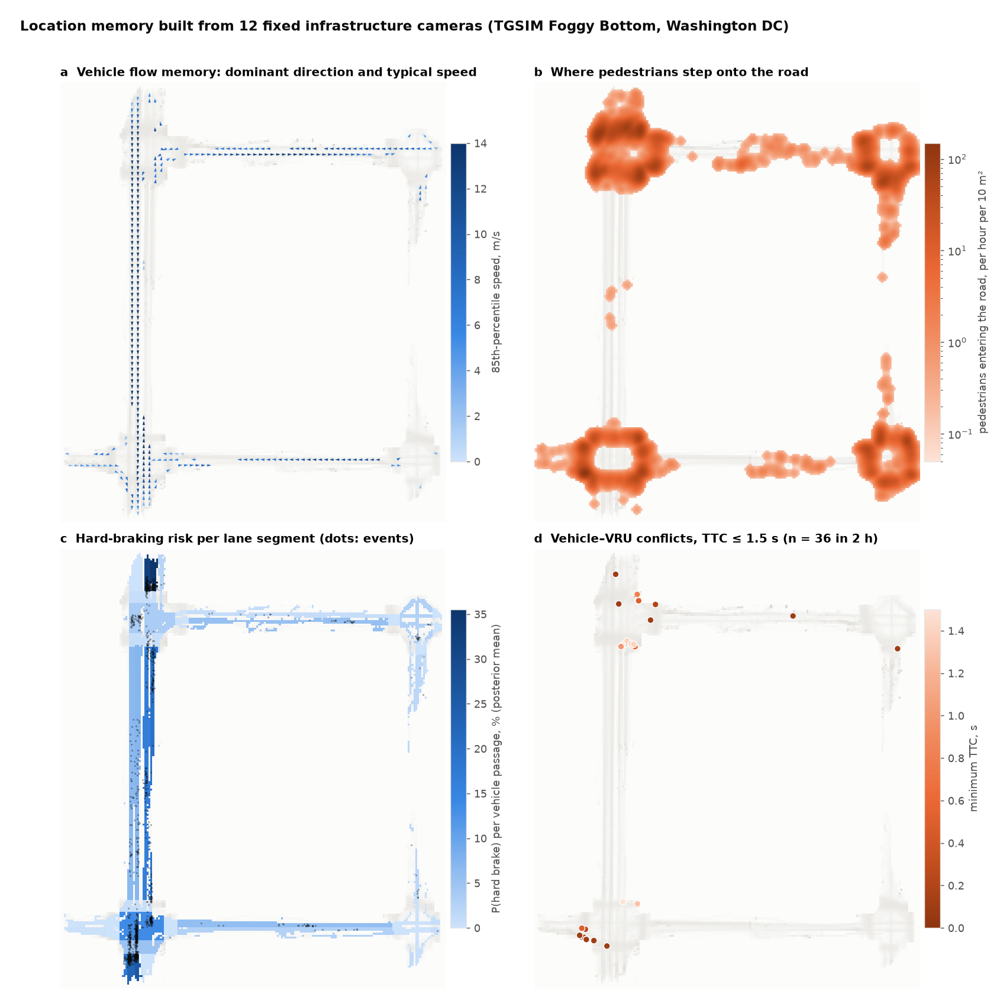
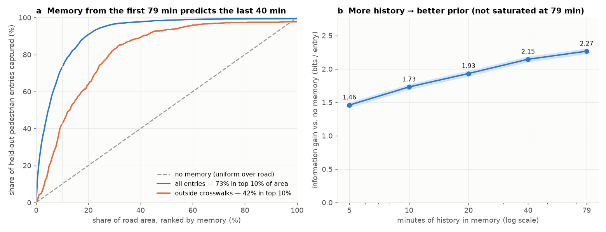
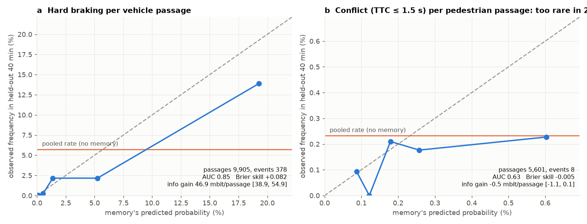
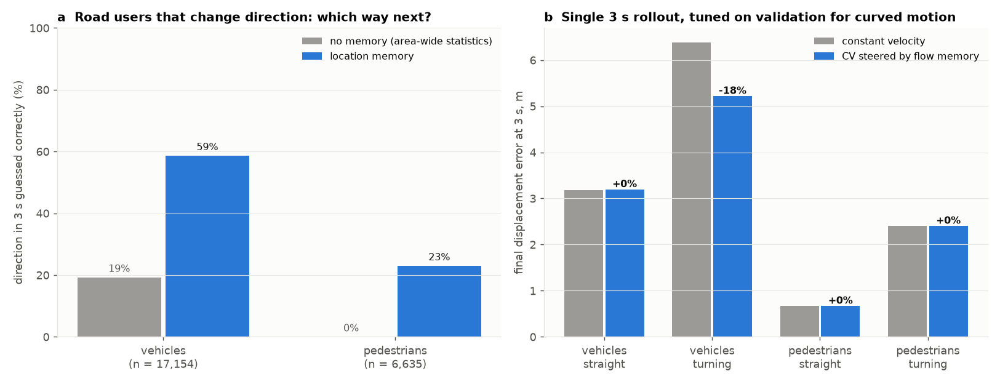
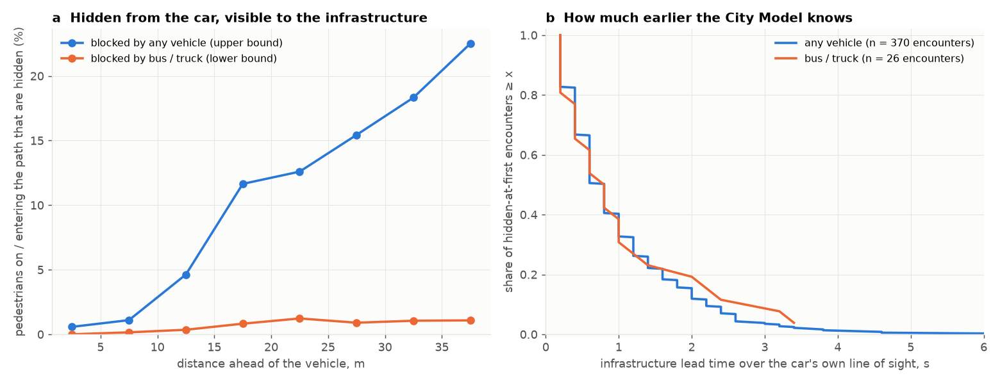
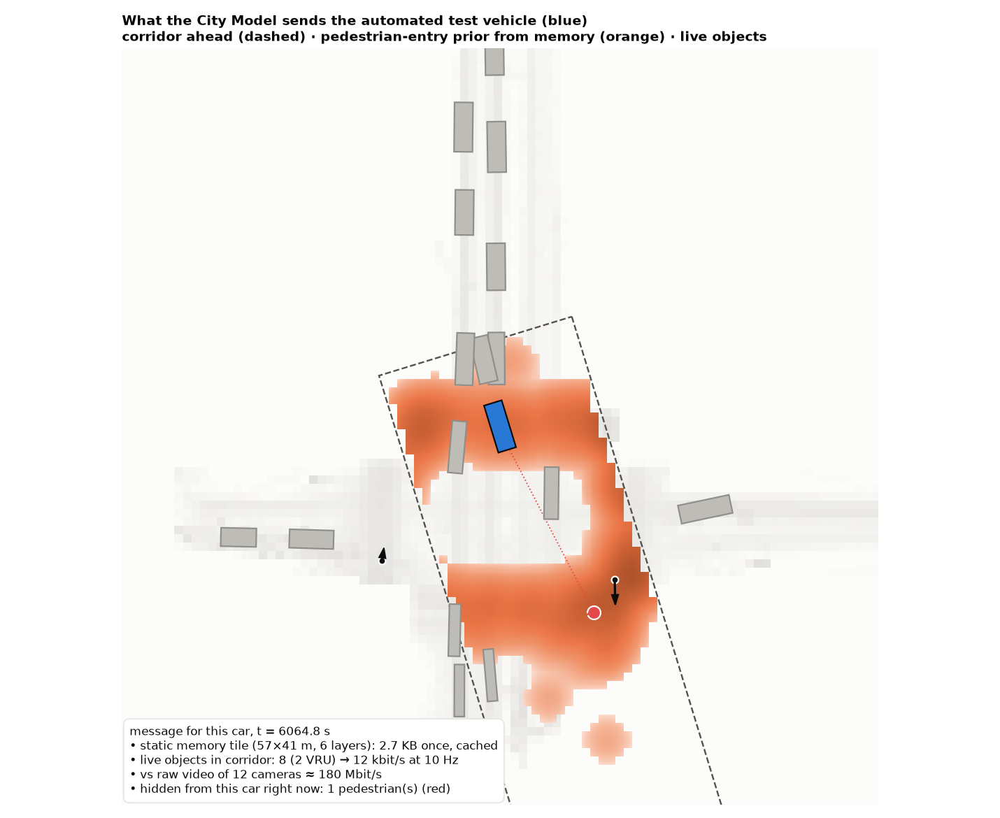

# Part 2 — closed-loop simulation: does memory help a robotaxi drive?

**Scene** (calibrated on Part 1): a 90 m block with a dense parked row; the robotaxi drives in the adjacent lane
with 1.0 m clearance. Pedestrians step out between parked cars **where and how often they did in TGSIM**
(99 real mid-block emergences on the top street, ≈ 50/h, peak 3.3× the mean) at the **real walking-speed
distribution** (median 1.5 m/s). 90% are attentive (wait if the car is < 3 s away), 10% step out without looking;
nobody walks into the side of a passing car. Robotaxi: roof sensor with 2-D line of sight through the parked row,
0.25 s perception, 7 m/s² emergency braking, 25 mph limit. Optional infrastructure camera: 0.3 s latency.

**Planners** share one occlusion risk model and one exchange rate between time and risk (the caution level); they
differ only in the pedestrian-intensity map they believe:

| Planner | Believes |
|---|---|
| worst case | a pedestrian may step out anywhere, any time (9 km/h past parked cars) |
| **no memory** | the street's true *average* rate everywhere: knows *how many*, not *where* |
| **location memory** | a map estimated from 10 h of simulated camera observation (≈ 450 events, with sampling noise) |
| memory, may only add caution | memory, but never faster than the no-memory planner |
| perfect memory | the true map (upper bound) |
| + live camera | pedestrians approaching the curb are reported; covered sections are believed clear |

**Protocol**: rare-event design, one pedestrian per episode, weighted by the real emergence rate; 30,000
inattentive + 3,000 attentive episodes per configuration, identical across planners (common random numbers);
paired bootstrap CIs. `tests/test_sim.py` checks, among others, that the worst-case planner never hits a
pedestrian walking at the planner's design speed, i.e. planner model and simulator agree.

## Results

| Question | Result |
|---|---|
| Does memory move the safety ↔ time frontier? | **−26% collisions at equal trip time** [20, 33]; or **1.1 s faster** (−6%) at equal risk; near misses also lower. 10 h memory ≈ perfect memory (−27%) |
| How much history is needed? | saturates at **≈ 4 h** (≈ 200 observed emergences on this street); 15 min is sometimes worse than no memory |
| Where does memory pay off? | grows with how concentrated activity is: 0% (uniform) → 11% → **27% (this street)** → 47% → 56% (peak 10× mean) |
| Live cameras on the whole block | 0.005 vs 2.1 collisions / 10k traversals **and** 3 s faster; memory then adds nothing (H3) |
| Partial camera coverage | memory still cuts collisions 10–36%, depending on how uneven the *uncovered* part is |
| Stale memory (hotspot moved 21 m to the quietest spot) | symmetric memory **worse than none** (2.52 vs 2.00 / 10k); a caution floor barely helps (2.44); **"may only add caution" → 1.62** (+1.4 s) |
| Camera fails silently vs with heartbeat | **3.83 / 10k** (1.8× worse than no infrastructure) vs **1.54** falling back to memory |
| Keeping memory fresh (E8): the hotspot moves while observations keep arriving | a change detector (1 h windowed G-test) notices within **45 min** with a camera (0.3 false alarms / month); mean collisions over the next 24 h: **1.47** vs 2.47 never updated, 1.99 adding all observations, 1.65 forgetting (which costs **+8%** when nothing changes) |
| …same with a fleet as the only observer | 10% fleet: median 1.25 h, 10% of changes unnoticed within a day; 3% fleet: only 19% noticed within a day |
| Phantom pedestrians reported by the camera (E9: false reports or injected) | a car that trusts every report brakes hard 1.6 times per phantom, at ≥ 6 m/s² in 28% of cases (66% for phantoms timed to cross just before the car); **own sensors first** (the camera only fills blind spots) refutes 99%: 0.5% emergency braking, no measurable safety cost |
| Camera silently drops real pedestrians, heartbeat healthy (E9) | trusted to say "clear": 1.04 / 2.01 / **3.83** collisions / 10k at 25 / 50 / 100% dropped; **"may only add caution"**: 0.43 / 0.82 / 1.54 (never worse than no camera), but 3 s slower per block when the camera is honest |
| Fleet audit of a camera that drops pedestrians (E9) | cars report pedestrians they saw that the camera had not; at 10 passes / h a CUSUM revokes trust after a median **2.5 h** (all dropped) to 13 h (25% dropped), with ≤ 1 false revocation per year |

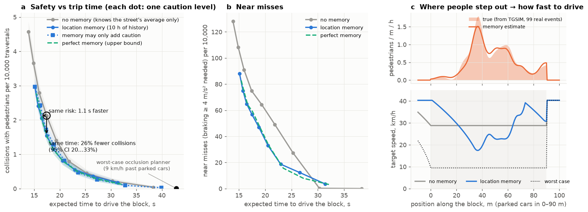
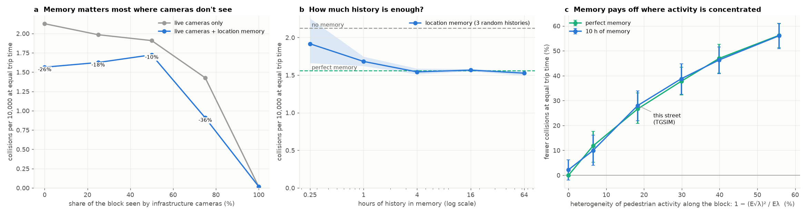
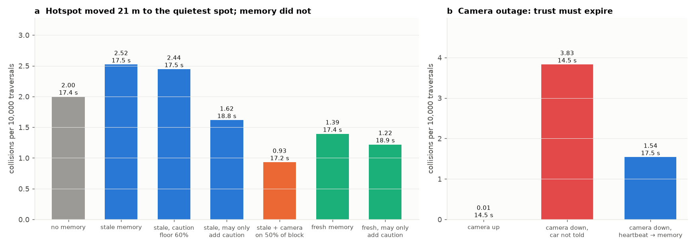
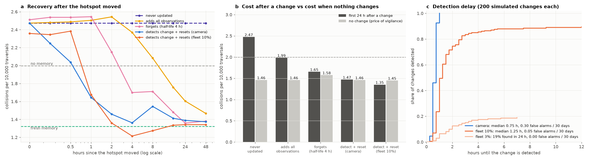
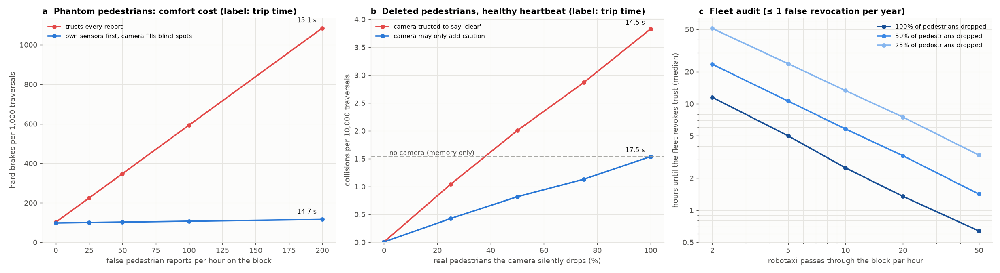

**Design rules that fall out of the experiments**

1. **Asymmetric trust, plus a change detector.** A location prior may *add* caution freely; *removing* caution
   needs fresh evidence. The cost is small: −21% instead of −26% collisions at equal time when the memory is right;
   the gain is large when it is wrong. A statistical change detector on live observations brings a stale memory
   back within about an hour, without the steady-state cost of simply forgetting old data.
2. **Trust must expire, and be audited.** Live "this area is clear" is the most valuable and the most dangerous
   message: every message needs an age, a missing heartbeat must revert the car to its prior, and cars should
   report pedestrians the camera missed so that a camera that silently drops people loses trust within hours.
3. **Own sensors first.** Where the car can see for itself, camera reports are ignored; the camera only fills blind
   spots. Phantom pedestrians then cannot trigger emergency braking in the car's view, at no measurable safety cost.
4. **Where to invest is predictable.** The benefit of memory tracks one number per place,
   1 − (E√λ)²/Eλ (how uneven pedestrian activity is), measurable from a few hours of camera data.

**Simulation limitations**: 1-D longitudinal planner and 2-D line of sight; one pedestrian per episode; synthetic
parked row (TGSIM polygons cover the parking lane only partly); pedestrians from the near side only; the
inattentive share is a free parameter, so **absolute collision rates are not calibrated to crash statistics —
only comparisons between planners are meaningful**. Outside E9 the camera never raises false alarms, which
flatters live infrastructure (E9 prices them separately); and with the camera up the simple planner
drives at the limit and brakes hard twice as often (101 vs 50 per 1,000 traversals) because attentive
pedestrians accept 3 s gaps: comfort-aware planning with live data is future work.

# Part 3 — fleet memory vs infrastructure memory

A fleet memory only knows what passing cars happened to see, and records a pedestrian **where and when a car first
saw it**. On the real TGSIM traffic every driving vehicle (4,828) is a potential fleet car with a 50 m roof sensor
whose 2-D line of sight can be blocked by other vehicles (parked and queued cars keep their orientation); a random
share of them is equipped. The fleet memory is built from those sightings and scored on the same held-out 40
minutes as the camera memory. In the simulator (E7), the share of time each metre of kerb is watched by equipped
cars, measured on the real traffic of the block (184 driving vehicles per hour), thins the memory's observations.

| Fleet penetration (equipped cars / h through the block) | Pedestrians seen | Held-out gain, all / outside crosswalks | Calendar time for the full planning benefit (E7) |
|---|---|---|---|
| **fixed cameras** | 100% | **2.27 / 0.84 bits** | **≈ 1 h** |
| 100% (184 / h) | 98% (0.2 s late, 0.2 m off) | 2.24 / 0.81 | ≈ 1 h |
| 30% (≈ 55 / h) | 71% | 2.14 / 0.71 | — |
| 10% (≈ 18 / h) | 37% | 1.96 / 0.62 | ≈ 4 h (after 1 h: barely better than no memory) |
| 3% (≈ 5.5 / h) | 17% | 1.62 / 0.37 | ≈ 16 h (after 1 h: **worse** than no memory) |

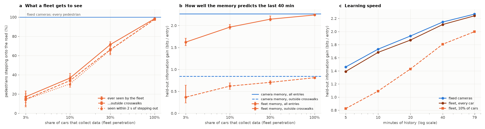
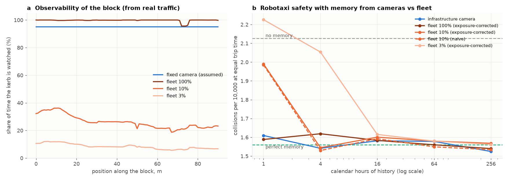

**Reading**

* **Quality is not the fleet's problem, exposure is.** When a car is there, it sees the pedestrian almost as well
  as a camera (0.2 s late, 0.2 m off). Memory quality is set by *equipped cars per hour × hours*: the calendar
  time a fleet needs scales roughly with 1 / penetration.
* This block at rush hour is the **fleet's best case** (congested, a car always nearby). On quiet streets, at night
  or at realistic robotaxi penetrations of a few percent, a fleet collects the equivalent of an hour of camera
  memory only after days — and a thin memory is worse than none for the planner.
* Pedestrians **outside crosswalks** (the hidden-pedestrian risk) are where the fleet lags most.
* Per-location exposure correction made no difference here because the fleet watched the kerb fairly uniformly
  (19–36% of the time at 10%); it matters where coverage is uneven (tested in `tests/test_fleet.py`).
* The fleet here is idealised (perfect detection within 50 m, every sighting uploaded) and can only observe
  pedestrians the cameras also tracked, so these are **upper bounds for the fleet**.

**So what fixed infrastructure uniquely adds**: memory in hours instead of days, independent of traffic;
live perception beyond the car's line of sight (Part 2: ≈ 99% fewer collisions, while it works); and exposure
for rare events. The two are complementary: a fleet can keep a camera's memory fresh where there is no camera.

# Part 4 — a full day at an instrumented intersection (DLR UT)

[DLR Urban Traffic](https://doi.org/10.5281/zenodo.15754836) (CC BY-NC-SA 4.0): 14 infrastructure multi-sensor
systems around the AIM research intersection in Braunschweig, **24 hours** (Sunday 24 Sep 2023), trajectories at
20 Hz and the states of **all 30 traffic lights** at 1 Hz; 28,378 vehicles, 3,153 cyclists, 765 pedestrians.
Memory from even hours, test on odd hours (both cover day and night); intervals resample whole vehicles.

**E10 — memory + live signal phase.** Predict a vehicle's speed class 3 s ahead. Which light governs which place
is itself learned from memory (mutual information between a light being green and vehicles there being stopped
3 s later): 244 of 1,035 places get a governing light.

| Moving vehicles near a light (63,750 test samples) | Speed class in 3 s correct | Info gain | Error of distance in 3 s |
|---|---|---|---|
| constant velocity | — | — | 4.82 m |
| area-wide statistics | 44% | 0 | 5.26 m |
| live signal phase only | 58% | 0.27 bits | 4.22 m |
| location memory only | 63% | 0.53 bits | 3.90 m |
| **memory + live phase** | **75%** | **0.82 bits** | **2.71 m (−44%)** |

This closes Part 1's open end (longitudinal error from signals that memory cannot know) and supports H3 on real
data: the two sources are complementary.

**E11 — time of day.** Conditioning memory on day vs night **does not help** here (0.27 vs 0.26 bits by day, 0.26
vs 0.25 at night): once current speed and the light are known, the place behaves alike at any hour.

**E12 — conflicts over a full day.** Still rare: 24 vehicle–VRU conflicts (TTC ≤ 1.5 s; 22 with cyclists), at two
crossing points; the 8 of even hours put 15 of the 16 of odd hours in the top 10% of area — stable hot spots, but a
small sample.

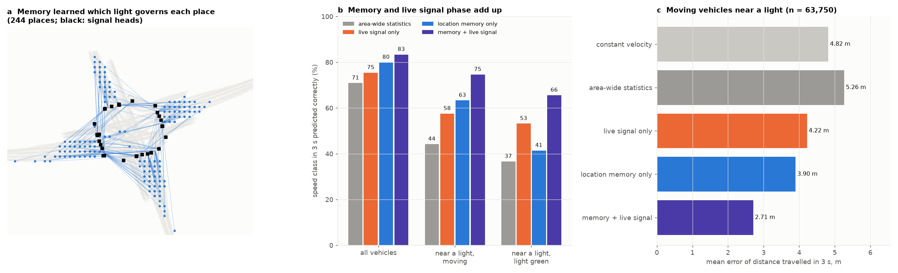
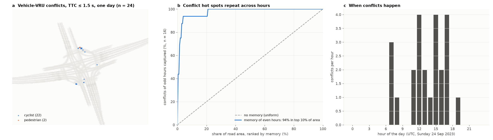

# Part 5 — does memory transfer across days? (pNEUMA)

[pNEUMA](https://open-traffic.epfl.ch) (Barmpounakis & Geroliminis, CC BY 4.0; data source: pNEUMA – open-traffic.epfl.ch):
a swarm of drones over downtown Athens on four weekday mornings (Wed 24, Mon 29, Tue 30 Oct, Thu 1 Nov 2018).
Subset: two drone areas, the same four half-hours (08:30–10:30) each morning, streamed out of the 15.8 GB Zenodo zip
with HTTP range requests; **74,405 vehicles** (28,163 cars, 26,807 motorcycles, 14,213 taxis, …), vehicles only.

**E13.** For each test half-hour, memory built from the same morning's other half-hours (1.5 h), the **same
half-hour on the other three mornings (1.5 h)**, all half-hours of the other mornings (6 h), or everything else
(7.5 h); scored against area-wide statistics on the heading and the speed class 3 s ahead.

| 3 s ahead | area-wide | same morning (1.5 h) | **other mornings (1.5 h)** | other mornings (6 h) | all (7.5 h) |
|---|---|---|---|---|---|
| heading (moving vehicles) | 83.4% | 92.7% · 0.472 bits | **92.6% · 0.463 bits** | 92.9% · 0.481 | 93.0% · 0.488 |
| speed class | 73.2% | 73.8% · 0.060 bits | **73.8% · 0.057 bits** | 74.4% · 0.084 | 74.6% · 0.093 |

* **Memory transfers across days**: at equal volume, other mornings give 98% (heading) and 94% (speed) of the
  information of the same morning; with three other mornings memory beats same-morning memory (102% and 139%).
* Without the signal phase, memory predicts speed in dense Athens traffic only weakly (+0.06–0.09 bits; 3 s distance
  error 1.98 → 1.89 m) — consistent with Part 4: speed needs memory **and** live signal data.
* Only vehicles here; cross-day transfer for **pedestrians** is tested in [Part 7](#part-7--pedestrian-memory-across-days-ind).

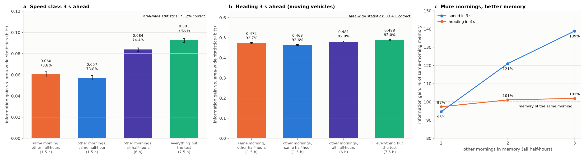

# Part 6 — where does infrastructure pay off? (cost-benefit)

The unit is one **block face** like the simulated street: 90 m of kerb with parked cars. The baseline is what a
fleet can do alone: robotaxis already use a **fleet-learned memory** (Part 3). Against it, four options for the city:
memory from **existing CCTV** (software only), **new cameras** for memory, and a **live camera** with a roadside
unit, either **trusted** to say "clear" (with the heartbeat, onboard priority and fleet audit of E9) or used so that
the car is **never worse than without it** (old speed kept, benefit taken as safety only).

**E14 — what one traversal gains** (simulator, by unevenness of pedestrian activity, results/value_metrics.json).
At equal risk, memory saves 0.2–1.7 s per traversal of the block (1.2 s on this street); a trusted live camera
saves ~3.45 s at any unevenness, because the speed limit binds. A camera whose reports may only add caution saves
1.2–3.4 s *if the operator raises its overall speed* — but then the E9 guarantee "never worse than no camera" is gone.

**Money** (2023 $, [econ.py](src/cityprior/econ.py) lists every value with its source):

| Input | Base (range) | Source |
|---|---|---|
| discount rate | 7% (3.1%) | USDOT BCA Guidance 2025 Update II (May 2025); 2025 Update (Nov 2024) |
| value of travel time | $21.10 / person-hour | USDOT BCA Guidance 2025, Table A-2 |
| crash costs | K $13.2 M, injury (unknown severity) $229,800 | USDOT BCA Guidance 2025, Table A-1 |
| robotaxi pedestrian injury crashes | 7 in 271.3 M miles (human benchmark 93) | Waymo Safety Impact hub, through June 2026 |
| CCTV camera, furnished and installed | $6,220 ($4,575–8,018) | ITS JPO Sample Unit Cost Database, 2017–2023 entries, n = 46 |
| roadside unit | $11,000 ($7,000–50,000) | ITS America V2X Deployment Plan (2023), via ITS JPO |
| riders per traversal, vehicle-hour value, free-flow share, site works, edge compute, analytics, maintenance, changes per year | stated ranges | assumptions, varied in the sensitivity analysis |

**E15 — results** (results/econ_metrics.json)

| Option (this street) | Value per traversal | Cost | Break-even robotaxi traversals / day |
|---|---|---|---|
| live camera, trusted | 2.23 s beyond memory = **0.77 ¢** | $38,440 + $5,044 / year | **3,750** (Monte Carlo 90%: 2,340–7,450; 3,410 at 3.1%) |
| live camera, never worse than none | safety only: 0.06 ¢ | same | ~50,000 |
| memory from existing CCTV | beyond fleet memory: **≤ $6.5 / year** per site | $1,770 / year | never (1,170 / day if fleets had no memory) |
| new cameras, memory only | same | $22,440 + $3,444 / year | never |

* **Live perception is what cameras sell**, and it pays only at high robotaxi volume: 3,750 traversals a day is a
  third of a 10,000-vehicle street. Probability of a positive NPV over parameter uncertainty: 19% at 3,000 / day,
  98% at 10,000 / day. The break-even hardly depends on unevenness (the live camera's gain is capped by the speed
  limit); it is moved most by the share of traversals where traffic ahead does not bind, the value of a
  vehicle-hour and the roadside-unit cost.
* **The benefit is time, not avoided crashes.** Robotaxis already hit pedestrians rarely, so memory taken as safety
  is worth 0.023 ¢ per traversal vs 0.41 ¢ taken as time (18×); at the human benchmark crash rate the two would be
  comparable. The cheaper guarantee "never worse than no camera" therefore costs almost the whole business case.
* **Memory is worth having, not buying cameras for.** Once a fleet passes ~18 times an hour it recovers from a
  change as fast as a camera (E8), so camera memory adds at most a few dollars a year to fleet memory, even with
  three fleets that do not share data. Existing CCTV would pay for memory only for an operator without its own.
* Per-traversal fee that covers a live camera: 0.96 ¢ at 3,000 traversals / day, 0.29 ¢ at 10,000, 0.10 ¢ at
  30,000, against a value of 0.77 ¢ to the operator: a city could sell the live feed on busy corridors.

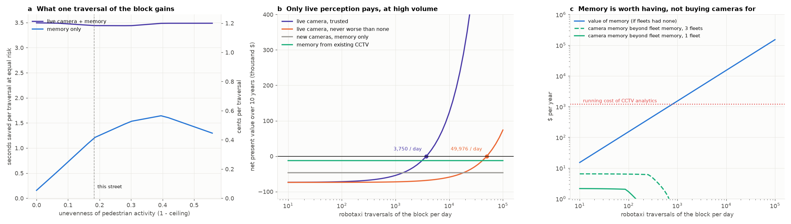
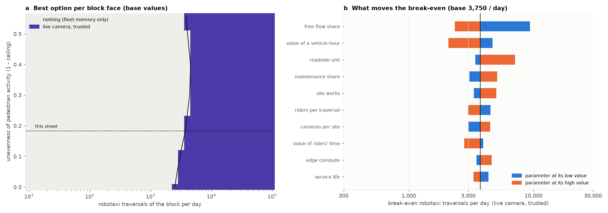

# Part 7 — pedestrian memory across days (inD)

[inD](https://www.levelxdata.com/ind-dataset) (Bock et al., IEEE IV 2020; free for non-commercial use, not
redistributed here): drone recordings of four intersections in Aachen, 33 recordings of 13–22 minutes, all road users
in metres in one frame per site. Sessions are runs of recordings on the same weekday: site 1 Tue / Mon / Tue
(another session), site 2 Tue / Wed, site 4 Wed / Tue / Mon; site 3 has one session and is left out.

**E16.** The roadway of a site is where vehicles drive (all sessions; it is geometry, not behaviour); a road entry is
a pedestrian stepping onto it after at least a second off it. For each recording, memory of entries is built from
the other recordings of the **same session**, from **other sessions** subsampled to the same number of entries
(20 draws), or from all other sessions, and scored on the recording's own entries against a uniform prior over the
roadway (intervals resample whole pedestrians).

| 2,542 held-out entries (3 sites) | same session | **other days, equal volume** | other days, all |
|---|---|---|---|
| information gain (bits / entry) | 2.59 [2.51, 2.66] | **2.40 [2.32, 2.48]** | 2.46 [2.38, 2.53] |
| entries in the top 10% of road area | 79% | **78%** | 78% |

* **Pedestrian memory transfers across days**: memory from other days keeps 93% of the information of same-day
  memory at equal volume, and 77–78% of a day's road entries fall in the 10% of road area memory from other days
  ranks highest.
* By site: 99% of same-day information at site 2 (1,718 entries), 87% at site 1 (671), 58% at site 4 (196 entries;
  equal volume leaves only ~47 entries of memory, wide interval).

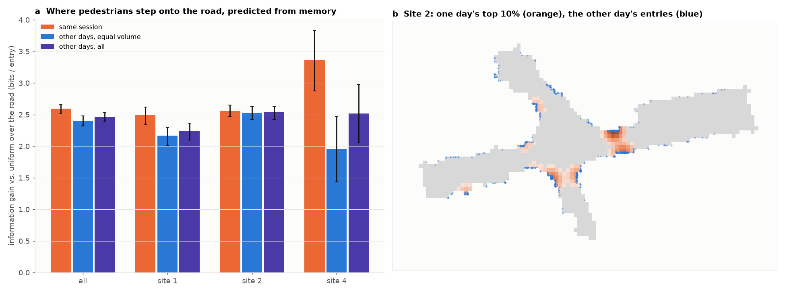

# Part 8 — memory improves pedestrian and cyclist forecasts on other days (inD)

**E17.** For every pedestrian or cyclist in motion at the three inD sites with several sessions (263,627 anchors every
0.4 s, 5,215 tracks, 22% cyclists), predict the position 1, 2 and 3 s ahead from the last 1.2 s of the track:

* **constant velocity**;
* **memory only**: how road users who were in the same 1 m cell heading the same way moved on (forward progress and
  sideways share relative to their own speed, shares turning left and right), applied to this agent's speed;
* **kinematics**: gradient boosting on the agent's own recent motion (residual to constant velocity);
* **kinematics + context**, the strong baseline: plus the nearest vehicle and the nearest other pedestrian or cyclist
  (relative position, velocity, time and distance of closest approach) and the crowd within 5 m;
* **kinematics + context + memory**.

Leave-one-session-out: the test session is a day the model has not seen, and memory comes only from other days —
also for training rows, whose memory excludes their own session, so the model never learns to trust a memory that
contains its own future.

| 3 s position error | constant velocity | memory only | kinematics | kinematics + context | **+ memory** | memory over the strong baseline |
|---|---|---|---|---|---|---|
| all | 1.14 m | 1.03 m | 0.94 m | 0.89 m | **0.84 m** | −5.2% [−0.050, −0.043 m] |
| pedestrians | 0.71 | 0.69 | 0.67 | 0.63 | **0.58** | −7.3% |
| cyclists | 2.65 | 2.26 | 1.93 | 1.82 | **1.77** | −2.6% |
| turning > 30° in 3 s (14%) | 3.12 | **2.16** | 2.22 | 2.09 | **1.82** | **−12.8%** [−0.28, −0.25 m] |
| going straight | 0.81 | 0.85 | 0.73 | 0.69 | **0.68** | −1.4% |
| a vehicle within 10 m | 1.17 | 1.06 | 0.98 | 0.93 | **0.88** | −5.1% |

* **Memory from other days improves the forecast on top of a strong baseline in all eight held-out sessions**,
  most where people change direction — the movements state-of-the-art predictors miss in dense mixed traffic
  (HetroD, arXiv 2602.03447). Altogether the model is 26% better than constant velocity.
* Memory alone, scaled to the agent's speed, beats constant velocity (1.03 vs 1.14 m) and, for turning agents,
  even the kinematic model (2.16 vs 2.22 m).
* **How much memory**: about 11 minutes of other days (10% of the recordings) already help (0.871 vs 0.890 m);
  the full ~1.9 hours per site give 0.843 m, and the curve has not flattened.

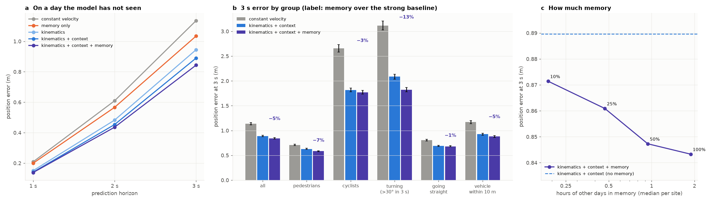

# Details

## What the memory holds

Sufficient statistics, not raw trajectories, and no identities:

| Layer | Per | Content | Used for |
|---|---|---|---|
| occupancy, exposure | 1 m cell × class | agent-seconds, distinct passages | normalising every rate by exposure |
| flow field | cell × class × 8 heading bins | count, mean direction, mean speed (a discrete [CLiFF map](https://arxiv.org/abs/2309.07066)) | motion prior |
| manoeuvre transitions | cell × heading now × heading in 3 s | counts | "which way next" distribution |
| speed | cell | vehicle p50 / p85 | typical-speed prior |
| pedestrian emergence | cell | first appearance on the road (after fragment stitching) | hidden-agent prior for occlusion-aware planning |
| hard braking, conflicts | cell and lane segment | events + exposure → empirical-Bayes Beta posterior with 90% interval | risk layer with uncertainty |

The whole 200 × 230 m area packs into **276 KB raw / 20 KB compressed** (6 uint8 layers).

## Method notes

* **Cleaning**: pedestrian track fragments (tracker re-identification) are stitched when a track starts ≤ 1 s
  after another ended within 2 m of its constant-velocity extrapolation (15,307 → 14,237); tracks < 1 s are dropped.
* **Hard braking**: derivative of 0.5 s-smoothed speed ≤ −3.5 m/s² for ≥ 0.5 s at ≥ 3 m/s
  (the raw Kalman accelerations spike to ±28 m/s²).
* **Conflicts**: constant-velocity TTC with a 3-disc vehicle footprint and 0.3 m pedestrian disc, 3 s horizon.
* **Rates**: per-passage event probability per lane segment, Beta prior strength fitted by beta-binomial
  marginal likelihood (shrinks small segments towards the pooled rate).
* **Virtual-ego occlusion**: every moving vehicle is treated as a robotaxi; a pedestrian ahead (≤ 40 m) on or
  heading into its straight-line path (±2.5 m within 4 s) is *hidden* if the 2-D ray from the roof-front crosses
  another vehicle's footprint. Bounds: all vehicles (upper) vs buses/trucks only (lower).
* Prediction hyper-parameters are tuned on a separate validation split (memory 0–60 min, samples 60–80 min).

## Limitations

* **2 hours, one sunny weekday afternoon**, one site. No weather, lighting or day-of-week conditioning is possible
  yet; results are a lower bound on what months of memory would give, and an upper bound on transfer to other sites.
* The dataset contains road users **only inside the road polygons** (no sidewalks) and **no buildings**, so occlusion
  and infrastructure lead time are strongly **underestimated**: real cameras would see pedestrians on the
  sidewalk before they step out.
* Detection and tracking come from the dataset (Kalman-filtered); infrastructure perception errors are not modelled.
* Occlusion is 2-D; a roof sensor sees over low cars (hence the two bounds).
* Bandwidth reference for 4K video (15 Mbit/s per stream) is an order-of-magnitude figure, not a measurement.
* Memory learned from human drivers is a **prior**, not a policy: "most drivers do X here" ≠ "X is safe".

## Reproduce

```bash
python3 -m venv .venv && .venv/bin/pip install -e ".[dev]"
.venv/bin/python -m cityprior.pipeline      # downloads ~340 MB on first run, then ~30 s on a laptop
.venv/bin/python -m pytest -q
```

Outputs: `results/metrics.json`, `results/figures/*.png`.

```bash
.venv/bin/python -m cityprior.sim.experiments   # Part 2, ~8 min; writes results/sim_metrics.json, figures/sim*.png
.venv/bin/python -m cityprior.fleet             # Part 3, ~8 min; writes results/fleet_metrics.json, figures/fleet*.png
.venv/bin/python -m cityprior.sim.change        # E8, ~4 min; writes results/change_metrics.json, figures/sim4*.png
.venv/bin/python -m cityprior.sim.spoof         # E9, ~40 s; writes results/spoof_metrics.json, figures/sim5*.png
# Part 4: download and unzip DLR-Urban-Traffic-dataset_v1-3-0.zip (420 MB, Zenodo 15754836) into data/raw/dlr_ut/
.venv/bin/python -m cityprior.dlr_experiments   # ~30 s the first time; writes results/dlr_metrics.json, figures/dlr*.png
.venv/bin/python -m cityprior.pneuma_experiments  # Part 5; streams ~1.4 GB of pNEUMA once (~10 min), then ~1.5 min
.venv/bin/python -m cityprior.sim.value         # E14, ~8 min; writes results/value_metrics.json
.venv/bin/python -m cityprior.econ              # Part 6, ~2 s; writes results/econ_metrics.json, figures/econ*.png
# Part 7: unzip inD-dataset-v1.1.zip (access on request, levelxdata.com) into data/raw/inD/
.venv/bin/python -m cityprior.ind_experiments   # ~10 s; writes results/ind_metrics.json, figures/ind1_cross_day.png
.venv/bin/python -m cityprior.ind_predict       # Part 8, ~11 min CPU; writes results/ind_predict_metrics.json, figures/ind2_prediction.png
```

## Layout

```
src/cityprior/
  data.py        download, load, fragment stitching, flicker filter
  geometry.py    grid, ray–box intersection
  events.py      hard braking, pedestrian emergence, TTC conflicts
  memory.py      LocationMemory: layers, empirical-Bayes rates, flow queries, footprint
  evaluate.py    held-out scores vs the no-memory prior, bootstrap CIs
  prediction.py  constant velocity vs memory-steered rollouts
  occlusion.py   virtual-robotaxi line-of-sight analysis
  message.py     corridor message for one vehicle + byte accounting
  plots.py       figures
  pipeline.py    end-to-end run (Part 1)
  sim/
    world.py        street geometry, parameters, TGSIM-calibrated emergence profile
    planner.py      occlusion risk model, speed profiles, memory estimation, camera coverage
    engine.py       vectorised closed-loop simulator, rare-event summary
    experiments.py  E1–E6 (Part 2)
    change.py       E8: keeping memory fresh (update strategies, sequential change detector)
    spoof.py        E9: phantom and dropped pedestrians, onboard priority, fleet audit (CUSUM)
    value.py        E14: seconds saved and collisions avoided per traversal, by unevenness and source
    figures.py
  fleet.py        fleet sightings (line of sight on real traffic), fleet memory, E7 (Part 3)
  fleet_figures.py
  dlr.py          DLR UT loader (10 Hz common schema), traffic lights, signal heads
  dlr_experiments.py  E10-E12 (Part 4): memory + live signal phase, time of day, conflicts
  dlr_figures.py
  pneuma.py       pNEUMA reader: members streamed from the Zenodo zip, parsed, 5 Hz, cached
  pneuma_experiments.py  E13 (Part 5): cross-day transfer of memory
  pneuma_figures.py
  econ.py         Part 6: cost-benefit per block face, parameters with sources, Monte Carlo, tornado
  econ_figures.py
  ind.py          inD reader, roadway from vehicle paths, pedestrian road entries, memory density
  ind_experiments.py  E16 (Part 7): pedestrian memory across days
  ind_predict.py  E17 (Part 8): pedestrian and cyclist forecasts with context and memory, leave-one-session-out
  ind_figures.py
tests/           geometry, TTC, braking detector, memory, simulator consistency, fleet line of sight, change detection, attacks, signal association, pNEUMA parsing, cost-benefit arithmetic
```

## Next steps

1. **Hybrid memory**: camera memory kept fresh by fleet sightings where cameras are absent; time-of-day
   conditioning (fleet exposure collapses off-peak).
2. **Adaptive attackers** who know the audit (dropping only a few pedestrians, only where cars cannot see),
   cross-checks between overlapping cameras, and detector errors measured on real video.
3. **Russian parameter set** for Part 6 (value of time and crash costs by Russian methodology, local camera
   prices) and robotaxi volumes that grow over the service life.
4. **Longer time spans** — weeks and seasons rather than sessions days apart — and weather conditioning (DLR UT's
   day was dry).

## Licence, data and citation

Code: [MIT](LICENSE). The datasets are **not** redistributed here; download them from their publishers and keep
their terms: TGSIM Foggy Bottom (U.S. DOT, public domain), DLR Urban Traffic (CC BY-NC-SA 4.0, non-commercial),
pNEUMA (CC BY 4.0; data source: pNEUMA – open-traffic.epfl.ch), inD (non-commercial, on request; Bock et al. 2020). To cite this work, see [CITATION.cff](CITATION.cff).

The code and the text were developed with the assistance of an AI coding assistant (Claude, Anthropic); the author
designed the study, reviewed the code and the results, and is responsible for the content.
